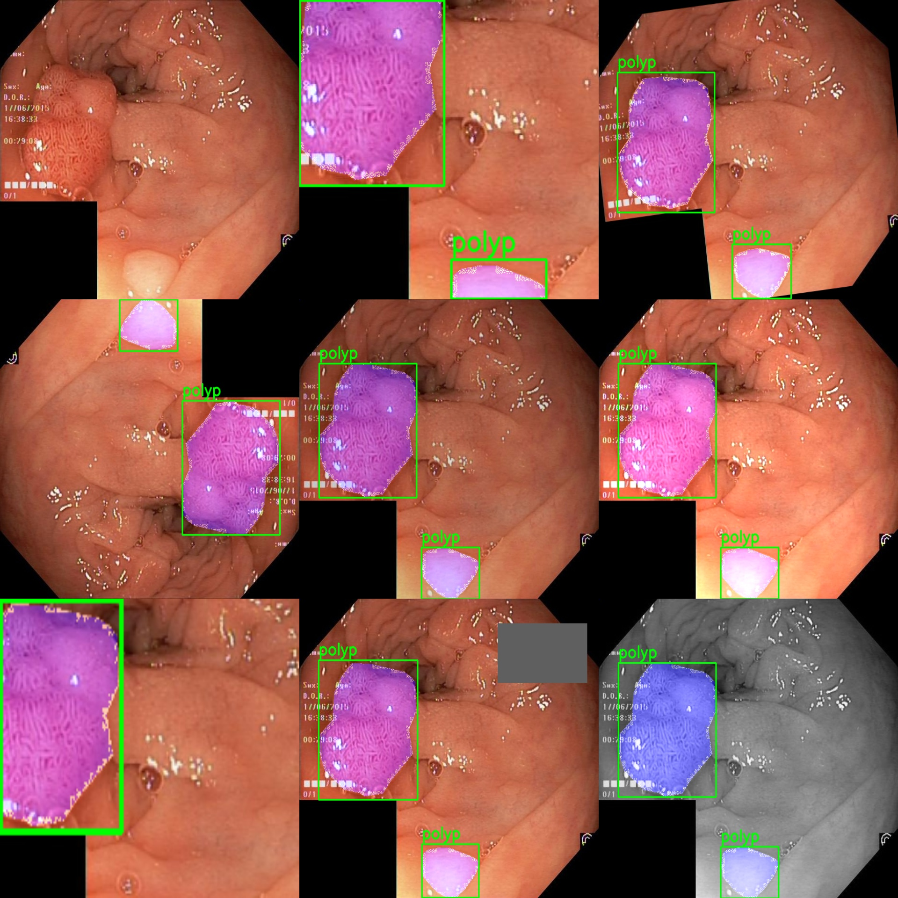
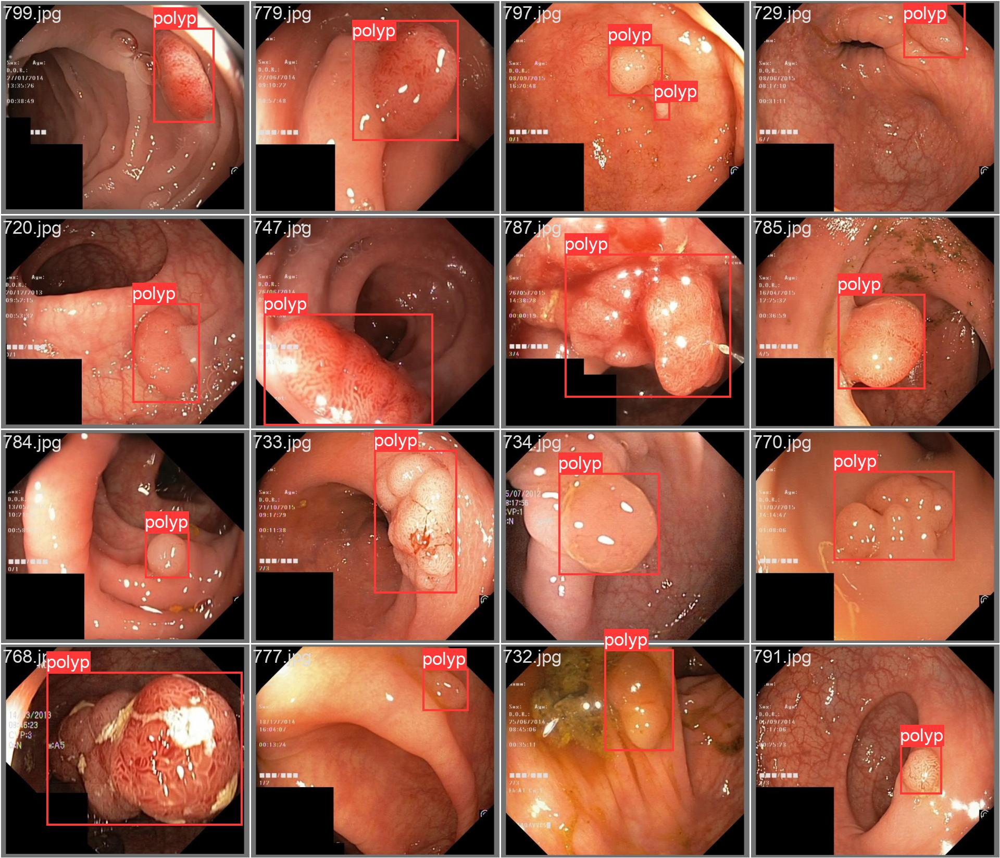
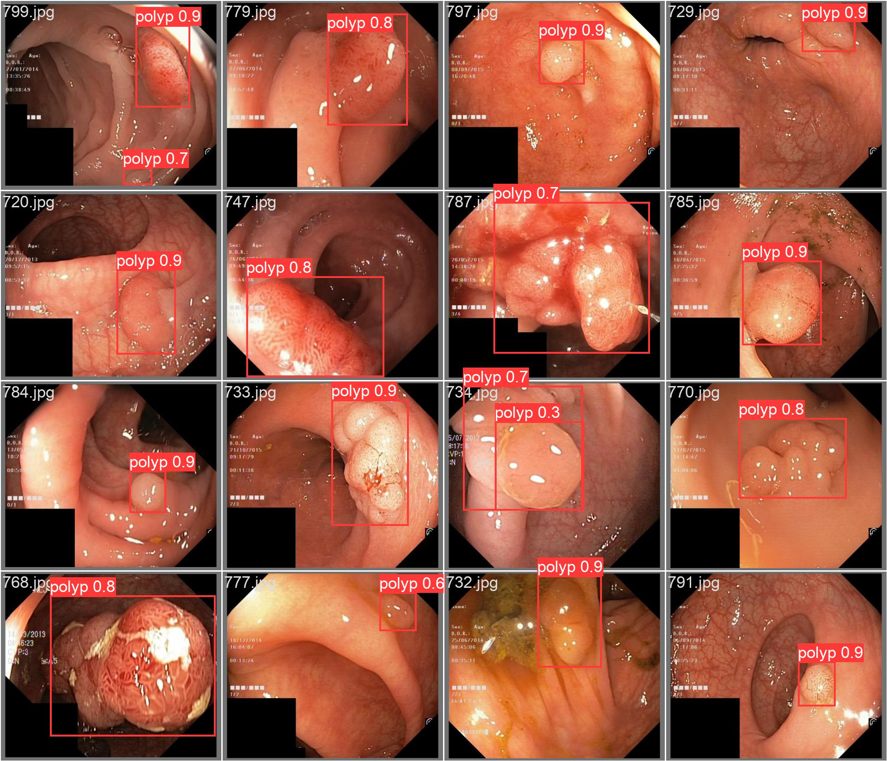
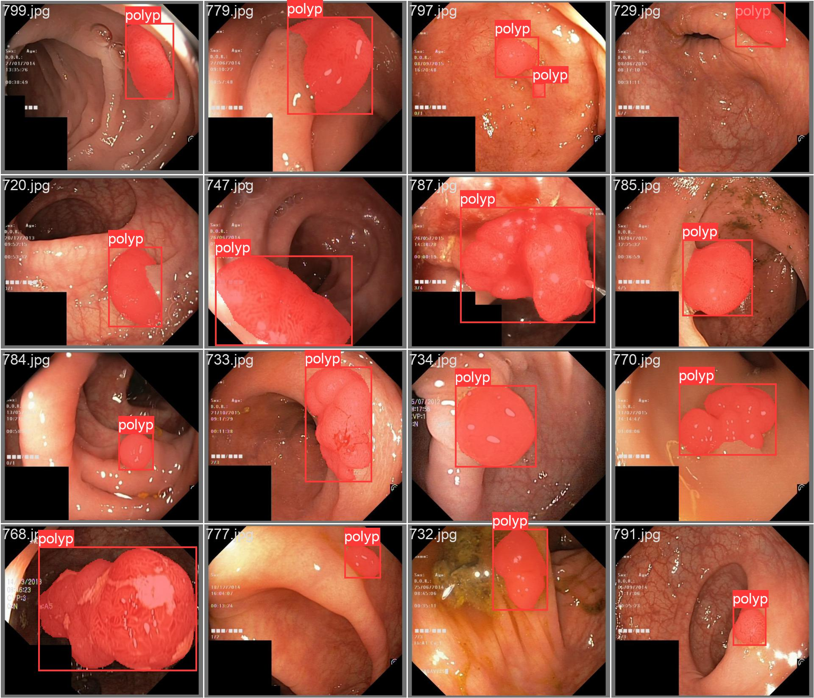
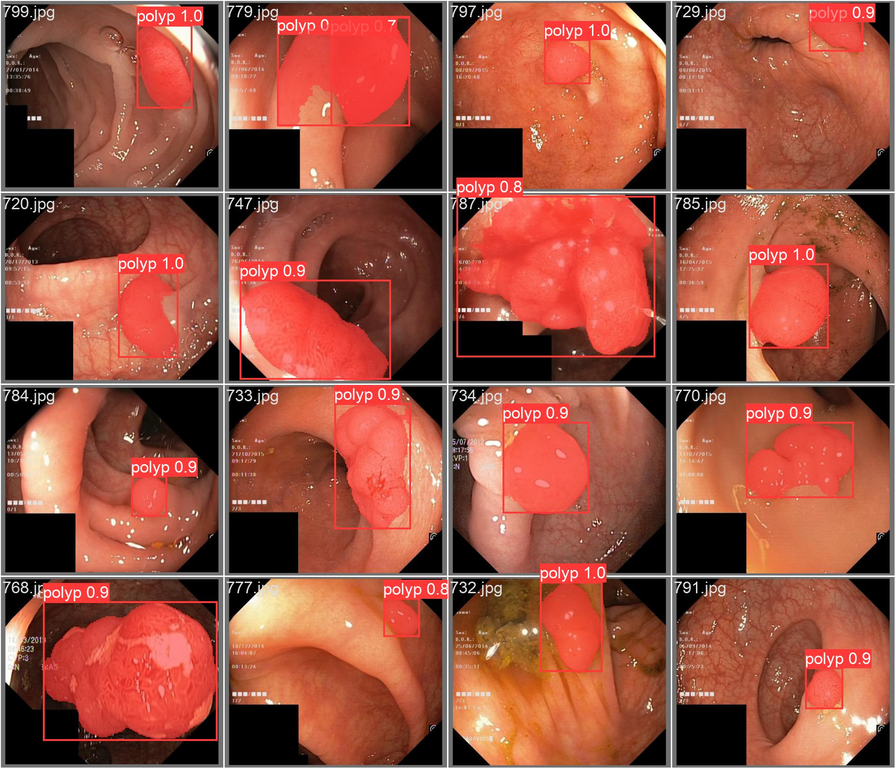

# Ployp detection via YOLOv8 & ResUnet++
---
## Dataset

### Dataset
A ployp dataset with 1000 imgs/masks/bboxes. 800 for train and 200 for test.

While there's no Val dataset, split 10% from the training set as the verification set.
| Set       | Num     |
|---------- |---------|
|   Train   |   720   |
|   Test    |   200   |
|   Val     |   80    |

An example:


### Data augmentation

See `data_augmentation.py` for details.

Offer a `see_augmentor()` function to check the augmentation. Result saved in `./see_data` dir.
```python
see_augmentor("mini_dataset", "101.jpg")
```
An example:



---
## Models

ResUnet++, for details, see `model.py`, and modules in `modules.py`.

---
## File Structure
```
.
├── config.yml  # model config
├── data_augmentation.py    # data augmentation class & utils
├── dataloader.py           # data set & data loader
├── dataset                 # original dataset dir
│   ├── bbox                    # .csv bbox
│   ├── images                  
│   ├── masks
│   ├── test.txt
│   └── train.txt
├── logger.py               # tensorboardx utils
├── metrics.py              # loss functions
├── mini_dataset
│   ├── bbox
│   ├── images
│   ├── masks
│   ├── test.txt
│   └── train.txt
├── model.py                # model
├── modules.py              # model modules
├── pyutils.py              # Hyper parameter utils
├── see_data                # visualization data augmentation
│   ├── see_augmentor_101.jpg
│   └── see_raw_101.jpg
├── train.py                # train 
└── yolov8                  # yolov8 scripts
    ├── contours_detect_sample  # sample of my contours detect res
    ├── dataset             # dataset dir
    ├── dataset_utils.py    # trans original dataset to yolov8 format
    ├── result.jpg          # a predict res
    ├── runs                # yolov8 runs results, contains ckpts
    ├── yolo8.ipynb         # object detection script
    ├── yolo8_pretrained    # pretrained yolov8 models
    └── yolo8_seg.ipynb     # segmentation script
```

---
## Run and Test
### Env
```
$ conda create -n xxx python=3.8
$ conda activate xxx
$ (install torch)
$ pip install ultralytics
$ pip install tensorboardx
```

### ResUnet++
Dataset build via function `main("dataset", "new_dataset")` in `./data_augmentation.py`.
```
$ python data_augmentation.py
```
Data augmentation needs add a `if_augment` arg, i.e. `main("dataset", "new_dataset", if_augment=True)`
```
if __name__ == "__main__" :
    main("dataset", "new_dataset", if_augment=True)
```
Check the a image in *new_dataset/train* via `see_data()` function.
```
if __name__ == "__main__" :
    see_data("new_dataset/train", "rand_flip_348.jpg", if_csv=False)
```
Train a ResUnet++ model use `./train.py` script. But before that, u might need to manully change the model config and hyper parameters in `config.yml`
```
python train.py -c config.yml
```

### YOLOv8n
Transfer raw dataset format to YOLOv8 object detection format by `yolo8()` function in `dataset_utils.py`.
```
cd yolov8

# change data_utils.py 
if __name__ == "__main__" :
    yolo8(DEBUG=True)      
    yolo8_yaml()

python dataset_utils.py
```
Transfer raw dataset format to YOLOv8 segmentation format by `yolov8_seg()` function in `dataset_utils.py`.
```
cd yolov8

# change data_utils.py 
if __name__ == "__main__" :
    yolo8_seg(DEBUG=False)
    yolo8_seg_yaml()

python dataset_utils.py
```
Train and Test Yolov8 object detection use `./yolov8/yolov8.ipynb`. An example is:
```
model = YOLO("yolov8n.pt")
model.info()
results = model.train(data="dataset/yolo8/data.yaml", batch=32, epochs=100, imgsz=640, device=0, verbose=True, plots=True)
```
Train Yolov8 segmentation use `./yolov8/yolov8_seg.ipynb`. An example is:
```
# n 32
model = YOLO("yolov8n-seg.pt")
model.info()
results = model.train(data="dataset/yolo8_seg/data.yaml", batch=32, epochs=100, imgsz=640, device=0, verbose=True, plots=True)
```
To test YOlOv8 segmentation, I write a script in `./yolov8/yolov8_seg.ipynb` to calculate mIOU.
```
# cal ious MAT
ious = np.zeros((len(pred_masks), len(gt_masks)))
for i, pred_mask in enumerate(pred_masks):
    for j, gt_mask in enumerate(gt_masks):
        intersection_area = cv2.intersectConvexConvex(pred_mask, gt_mask)[0]
        union_area = cv2.contourArea(pred_mask) + cv2.contourArea(gt_mask) - intersection_area
        if union_area<=0:
            ious[i, j] = 0
            continue
        ious[i, j] = intersection_area / union_area

cur_avg_iou = 0
for i in range(len(pred_masks)):
    cur_avg_iou += ious[i, np.argmax(ious[i])]
cur_avg_iou /= len(pred_masks)
...
```
## Res
YOLOv8 ployp object detection `mAP@50:95` ~= 0.78 

Test Result example for Polyp Object detection.
<div style="display: flex; justify-content: space-around;">
    
    
</div>

YOLOv8 ployp Segmentation `mIOU` ~= 0.7

Test Result example for Polyp Segmentation.
<div style="display: flex; justify-content: space-around;">
    
    
</div>

---
## Cites
It cannot be completed without these :zap: awesome :zap: works:

- [ResUnet++ Torch Implementation](https://github.com/rishikksh20/ResUnet)

- [ResUnet++](https://github.com/DebeshJha/ResUNetPlusPlus-with-CRF-and-TTA?tab=readme-ov-file)

- [Ultralytic YOLOv8](https://www.ultralytics.com/)
