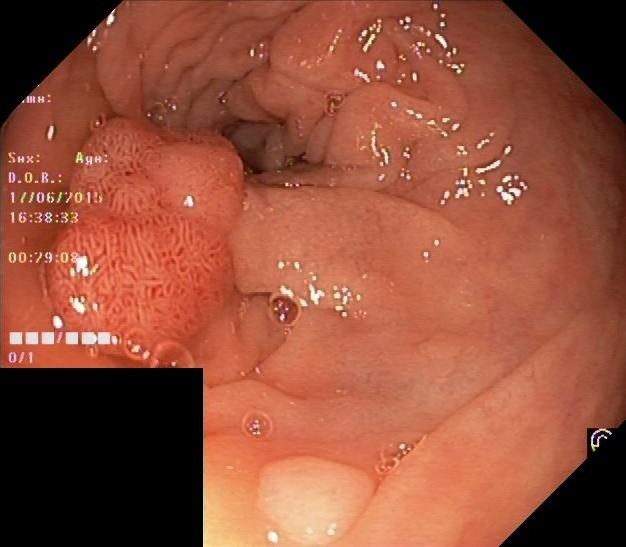

# Ployp detection via YOLOv8 & ResUnet++
---
## Dataset

### Dataset
A ployp dataset with 1000 imgs/masks/bboxes. 800 for train and 200 for test.

While there's no Val dataset, split 10% from the training set as the verification set.
| Set       | Num     |
|---------- |---------|
|   Train   |   720   |
|   Test    |   200   |
|   Val     |   80    |

An example:




### Data augmentation

See `data_augmentation.py` for details.

Offer a `see_augmentor()` function to check the augmentation. Result saved in `./see_data` dir.
```python
see_augmentor("mini_dataset", "101.jpg")
```
An example:


---
## Models

Still working on it...

---
## Cites
It cannot be completed without these :zap: awesome :zap: works:

- [ResUnet++ Torch Implementation](https://github.com/rishikksh20/ResUnet)

- [ResUnet++](https://github.com/DebeshJha/ResUNetPlusPlus-with-CRF-and-TTA?tab=readme-ov-file)

- [Ultralytic YOLOv8](https://www.ultralytics.com/)
